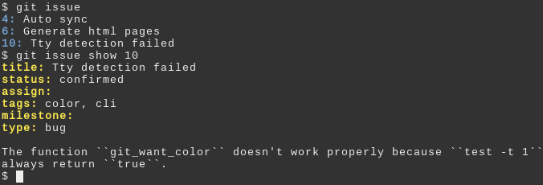

# Git-issue

*Git-issue* is a bug tracker based on git.

## Why?

Git is a great tool to versioning source but also to [store
everything](http://git-annex.branchable.com/). Git is [designed like a file
system](http://marc.info/?l=linux-kernel&m=111314792424707), or if you prefer
buzz words, you can see it like a [nosql
database](http://opensoul.org/blog/archives/2011/09/01/git-the-nosql-database/).
A [nosql database over a
FS](http://www.pdl.cmu.edu/PDL-FTP/Storage/CMU-PDL-12-103.pdf)?.

Sorry, I digress. So why do not use it to store issues? In fact, use git
automatically makes your issues tracker versioned and distributed, like your
code.

Of course, it is not the first [distributed issue
tracker](http://www.cs.unb.ca/~bremner/blog/posts/git-issue-trackers/) but
*git-issue* exist because the other projects doesn't cover all these objectives:

* fully based on git ;
* minimal dependencies ;
* fully tested.

## Installation

Place the single file *src/git-issue* in your path.

For example:

    $ git clone https://github.com/sanpii/git-issue.git
    $ mkdir -p ~/.local/bin
    $ ln -s $(pwd)/git-issue/src/git-issue ~/.local/bin
    $ echo 'export PATH=$PATH:$HOME/.local/bin' >> ~/.bashrc

## Configuration

*Git-issue* reuse git configuration (user name, editor, …) but provide some
options.

### issue.branch

The branch name used for store the issues. *issues* by default.

### issue.remote

Remote name to publish issues. *origin* by default.

### color.issue.id

Color use to display id. *blue bold* by default.

### color.issue.metadata

Color use to display metadata name. *yellow bold* by default.

### issue.html.branch

The branch where HTML pages as generated. *gh-pages* by default.

### issue.html.showdow

The URL where showdow.js was download.
<http://raw.github.com/coreyti/showdown/master/src/showdown.js> by default.

### issue.html.jquery

The URL where jquery was download.
<http://code.jquery.com/jquery-2.0.3.min.js> by default.

### issue.html.bootstrap

The URL where twitter bootstrap was download.
<http://netdna.bootstrapcdn.com/bootstrap/3.0.2> by default.

### issue.html.charset

The charset specified in the content type. *UTF-8* by default.

### issue.html.title

The title of the page. *Issues tracker* by default.

## Commands

### Initialize your issue database

This is the required first step:

    $ git issue init

### Create a new issue

    $ git issue new --title='A new issue' 'A long description'
    Issue #1 created.

If you don't specify a description, the issue is opened in an editor unless the
``--no-edit`` is added.

### Show an issue

    $ git issue show 1
    title: Issue title
    status: new
    assign:
    tags:
    milestone:
    type:

    A long description

### List all issue

    $ git issue list
    1: Issue title

By default, only unclosed issues are listed. You can use filter on *status*,
*title*, *tags*, *milestone* or *type*:

    $ git issue list --status=close

Or inverted filter:

    $ git issue list --status=~accepted

Or multiple values:

    $ git issue list --status='new|accepted'

### Edit an issue

    $ git issue edit 1

Git issue open the issue with your preferred editor. Edit, save and quit. The
issue is automatically committed.

Or you can rapidly edit issue metadata:

    $ git issue edit --status=done 1

## Close an issue

And you can more rapidly close an issue:

    $ git issue close 1

### Delete an issue

    $ git issue delete 1

### Synchronize issues

Bidirectional synchronize:

    $ git issue sync
    Issues synced.

### Publish issues as HTML

    $ git issue html
    $ git checkout gh-pages
    $ git push -u originn gh-pages

You can see the result for this repository
[here](http://sanpii.github.io/git-issue).

## A bug?

Clone this repository and use *git-issue* on it. After creating an issue, send
me a pull request.

## License

Copyright (c) 2013 Sanpi

Permission is hereby granted, free of charge, to any person obtaining a copy of
this software and associated documentation files (the "Software"), to deal in
the Software without restriction, including without limitation the rights to
use, copy, modify, merge, publish, distribute, sublicense, and/or sell copies of
the Software, and to permit persons to whom the Software is furnished to do so,
subject to the following conditions:

The above copyright notice and this permission notice shall be included in all
copies or substantial portions of the Software.

THE SOFTWARE IS PROVIDED "AS IS", WITHOUT WARRANTY OF ANY KIND, EXPRESS OR
IMPLIED, INCLUDING BUT NOT LIMITED TO THE WARRANTIES OF MERCHANTABILITY, FITNESS
FOR A PARTICULAR PURPOSE AND NONINFRINGEMENT. IN NO EVENT SHALL THE AUTHORS OR
COPYRIGHT HOLDERS BE LIABLE FOR ANY CLAIM, DAMAGES OR OTHER LIABILITY, WHETHER
IN AN ACTION OF CONTRACT, TORT OR OTHERWISE, ARISING FROM, OUT OF OR IN
CONNECTION WITH THE SOFTWARE OR THE USE OR OTHER DEALINGS IN THE SOFTWARE.
